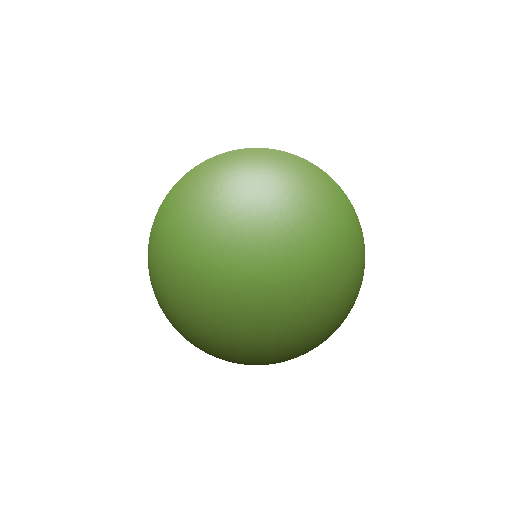
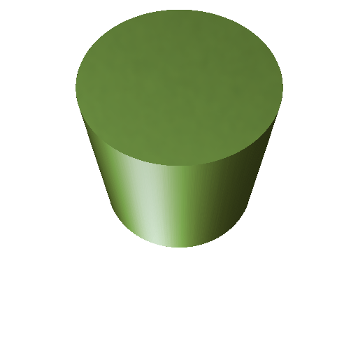
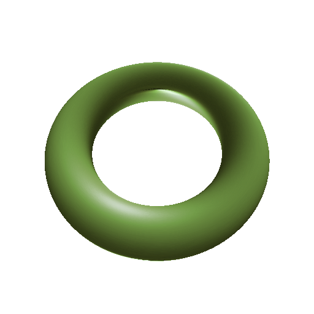
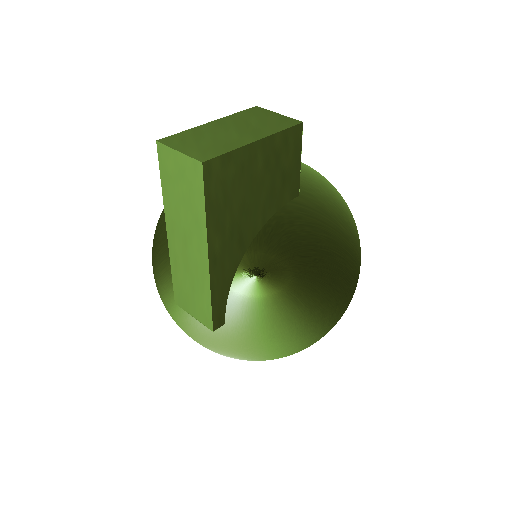
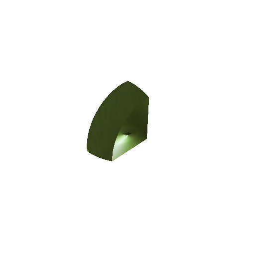
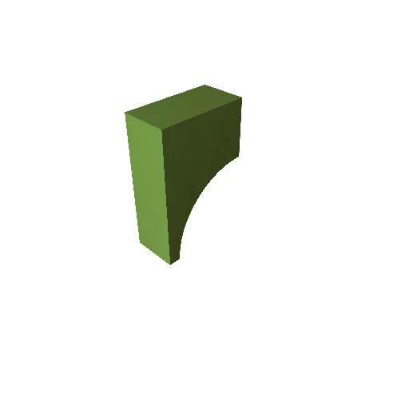
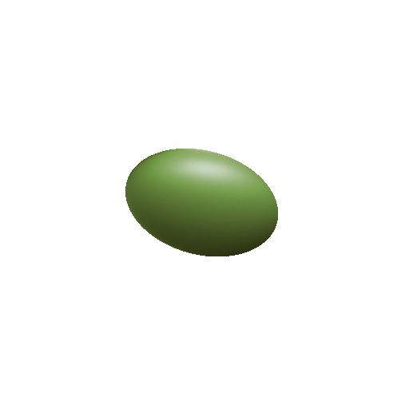

# FunctionRenderer
CSG and implicit function-based models are rendered using Sphere Tracing

Curved surface fidelty is independent of the number of meshes, only depends on the resolution of rendering image.




Boolean operation to represent more complex shapes.



Available to use quadric surfaces. If you know first derivative, you can add another function



## execute
```
$ git clone <this repository>
$ cd FunctionRenderer
$ mkdir build && cd build
$ cmake ..
$ make
$ ./function_renderer
```
## Modeling
- Implement some primitives and quadric surfaces
- Each model needs the function to return SDF(signed distance function) and normal for rendering
- Some models are difficult to compute SDF analytically, so substitute for first-order approximation
## Rendering
- When rendering the implicit function-based model, sphere tracing is used for collision judgement and normal computation insted of ray tracing for polygonal meshes
- First, decide the direction of the ray for each camera pixels (perspective)
- Second, sphere tracing to decide the collision point by marching the ray as much as the distance to the surface of models step by step
- When the distance is highly small, the ray is judged as hit and compute the normal of the surface at the point
- If the number of steps exceeds threshold, end the marching and judged as no-hit
- Finally, for all hit points, texturing using material capture shaders

# Reference
- [Taubin 1994 "Distance approximations for rasterizing implicit curves"](https://dl.acm.org/doi/10.1145/174462.174531)
- [Hart 1995 "Sphere Tracing: A Geometric Method for the Antialiased Ray Tracing of Implicit Surfaces"](https://www.researchgate.net/publication/2792108_Sphere_Tracing_A_Geometric_Method_for_the_Antialiased_Ray_Tracing_of_Implicit_Surfaces)
- [Inigo Quilez computer graphics, mathematics, shaders, fractals, demoscene and more](https://iquilezles.org/articles/distfunctions/)
- [Takikawa et al. 2021 "Neural Geometric Level of Detail: Real-time Rendering with Implicit 3D Shapes"](https://github.com/nv-tlabs/nglod)
